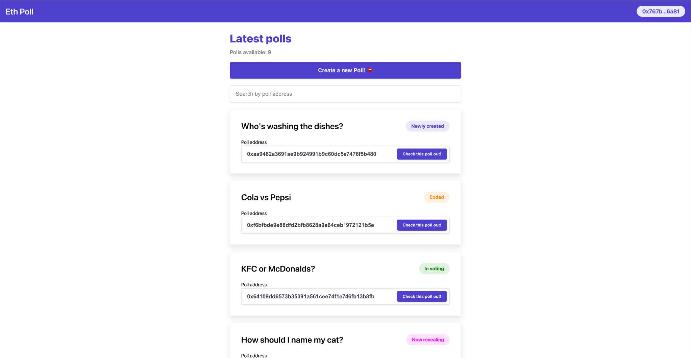
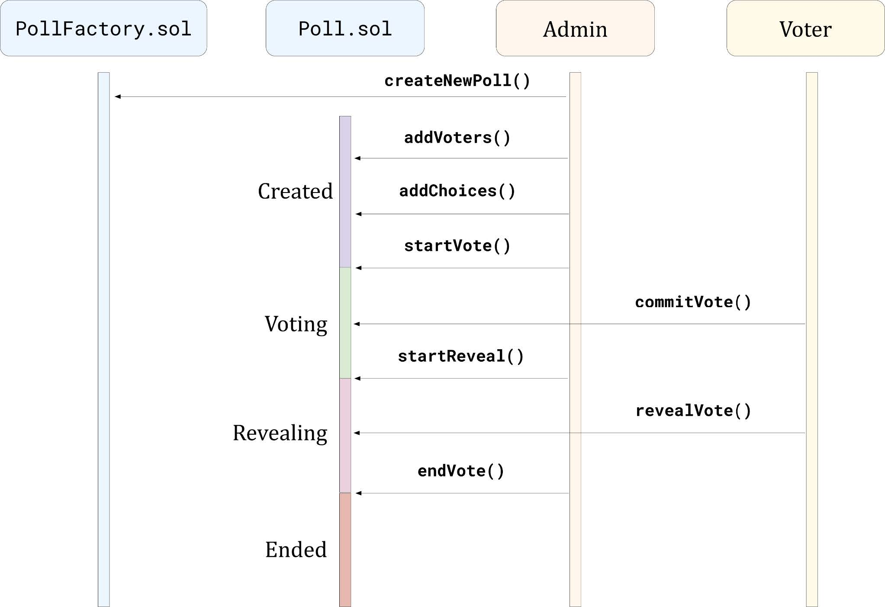
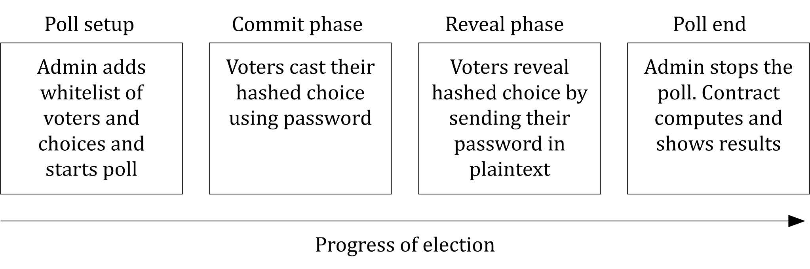

# React Eth Commit-Reveal Voting

Voting platform dapp for Final Year Project - Dapp made with React and Solidity smart contracts deployed to Kovan testnet

 

### About
The platform enables [Metamask](https://metamask.io/) users to conduct polls on the Ethereum blockchain. The polls follow the [Commit-Reveal scheme](https://en.wikipedia.org/wiki/Commitment_scheme). The [Truffle suite](https://trufflesuite.com/index.html) (Truffle, Ganache, Drizzle) and [Rimble UI](https://github.com/ConsenSysMesh/rimble-ui) were used to create the dapp. The backend is made up of two Solidity smart contracts, one representing the poll contract factory and the other encapsulating the poll logic. The factory is used to generate poll contract instances.

 

## Election process
The decentralized voting system features four stages, two of which follow the commit-reveal pattern and therefore must involve the voter’s participation in order for a choice to be accounted for. Poll owners are responsible of managing the progress and registering eligible voters by whitelisting the addresses of externally owned accounts. Thus, during the two-round voting process, poll interaction is restricted to registered users only.

